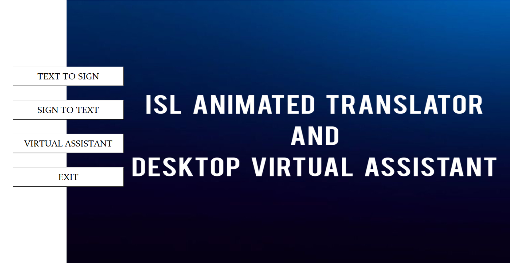

<p align="center">
  
</p>


<p align="center">  

  <!-- Latest Release -->
  


  <!-- Python Version -->
  
  
  <!-- IEEE Paper -->
  <a href="https://ieeexplore.ieee.org/stamp/stamp.jsp?tp=&arnumber=10270341&isnumber=10269805">
    
  </a>
</p>

---

# ISL Animated Translator & Desktop Virtual Assistant

## 🔬 AI-Powered Bi-Directional Indian Sign Language (ISL) Interpretation System

This repository contains the full source code, trained models, and assets for a robust, real-time ISL interpretation system developed as a B.Tech research project at **UMIT, SNDT Women’s University**.

Our work establishes a comprehensive framework for ISL communication, integrating advanced Computer Vision and Deep Learning techniques. 

---

## 📜 Academic Publication and Citation

This codebase directly supports the findings presented in our peer-reviewed IEEE conference paper.

### **Please cite our work if you use this code, methodology, or the trained models:**

> **Paper Title:** ISL Animated Translator and Desktop Virtual Assistant
>
> **Citation:** S. F. Naqvi, M. Z. Suleman, K. D. Verma and P. Dhanawat, "ISL Animated Translator and Desktop Virtual Assistant," 2023 3rd Asian Conference on Innovation in Technology (ASIANCON), Ravet IN, India, 2023, pp. 1-6, doi: 10.1109/ASIANCON58793.2023.10270341.
>
> **Link:** https://ieeexplore.ieee.org/document/10270341
>
> <a href="https://ieeexplore.ieee.org/document/10270341">
>   
> </a>

---

## 🔥 System Features

### 1. Real-Time Gesture Recognition ✋
* **MediaPipe Backbone:** Utilizes the robust **MediaPipe Hands** 21-point 3D landmark detection pipeline for accurate hand and pose tracking.
* **Dynamic and Static Gestures:** Capable of interpreting both static signs and dynamic actions used in ISL.

### 2. Deep Learning Classification 🧠
* **Action Classifier (`action.h5`):** An LSTM-based model trained on sequential landmark data to robustly classify words and short phrases. 
* **Virtual Assistant Model (`virtualassistant.h5`):** A dedicated lightweight model for translating recognized signs directly into desktop commands (e.g., launching applications).

### 3. Bi-Directional Translation 🔁
* **Text-to-Sign:** The system processes text input and accesses assets in the **`Animations/`** folder to render a corresponding ISL gesture sequence via an animated avatar.

---

## ⚙️ Installation and Setup

### 1. Clone the Repository
```bash
git clone https://github.com/farihaNaqvi/MediaPipe-ISL-Virtual-Interpreter.git

cd MediaPipe-ISL-Virtual-Interpreter

2. Create and Activate Virtual Environment (Recommended)This isolates the project's dependencies. We recommend Python 3.10 or 3.11 for maximum compatibility.Bashpython -m venv venv

# Windows (PowerShell):
.\venv\Scripts\activate

# macOS/Linux:
source venv/bin/activate

3. Install DependenciesInstall all required libraries, including TensorFlow, MediaPipe, and OpenCV:pip install -r requirements.txt

▶️ UsageRunning the TranslatorEnsure your webcam is connected and the virtual environment is active.python run_translator.py

(Replace run_translator.py with your file name if different.)The system will initialize the camera, detect hand landmarks, and display the real-time predicted ISL word/action.

LICENSE The Apache License 2.0.
